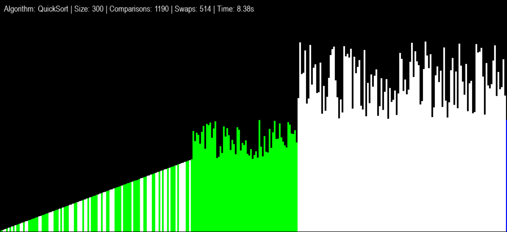

# 📊 Sorting Algorithms Visualization

An interactive Python application that visualizes various sorting algorithms using Pygame. Watch and hear how different sorting algorithms work in real-time! 🎵

## ✨ Features

- 📈 Visual representation of sorting algorithms with colored bars
- 🔊 Audio feedback for comparisons and swaps
- 📊 Real-time statistics display (comparisons, swaps, execution time)
- 🎮 Interactive controls
- 🔧 Adjustable array size (10-2000 elements)

## 🚀 Supported Algorithms

1. **Quicksort** (O(n log n) average case)
   - 🔄 Partition-based sorting
   - 📍 Uses last element as pivot

2. **Merge Sort** (O(n log n))
   - 🔀 Divide and conquer approach
   - ✅ Stable sorting algorithm

3. **Bubble Sort** (O(n²))
   - 💫 Simple comparison-based sorting
   - 📚 Great for educational purposes

4. **Heap Sort** (O(n log n))
   - 🌳 In-place sorting algorithm
   - 📦 Uses binary heap data structure

## 🎮 Controls

- **1-4**: Select sorting algorithm
- **SPACE**: Start sorting
- **ESC**: Reset/Return to menu
- **TAB**: Focus input box for array size
- Click on input box to change array size

## 🔧 Installation

1. Clone the repository
2. Install the required dependencies: 